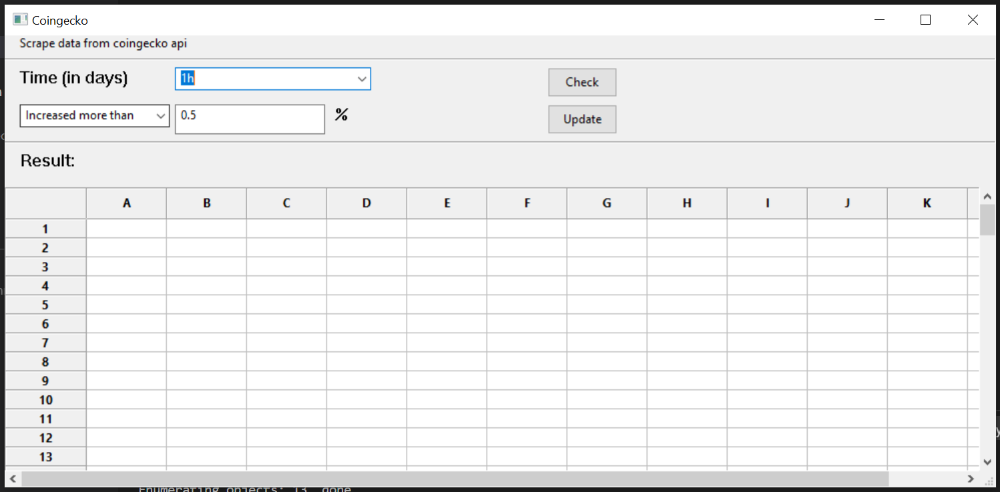

# Coingecko scraper

> Python/Tkinter desktop GUI app to connect to coingecko. This app uses Sqlite3 to store data
The app should be able to filter through every coin on coin gecko which 
- Price decreased by  more than X% over X days
- Price increase by more than   X% over X days
## Usage

```bash
# Install dependencies
pipenv install

# Run script
python ./src/main.py

# UI 


# Compiled with Pyinstaller

# Windows
python -m site
pyinstaller --onefile  --windowed ./src/main.py (run as admin)
pyinstaller -y -D --name coinscraper --paths "C:\Windows\System32\downlevel" --windowed -i "icon.ico" --clean --distpath="." -p "...site-packages" main.py


- Version: 1.0.0
- License: MIT
- Author: Annie Dang
